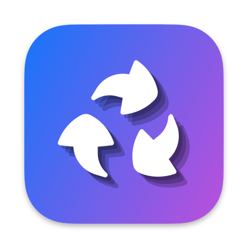

<div align="left">
  <a href="https://apps.apple.com/app/id6751111260">
    
  </a>
</div>

# BloatBuster Support

[](https://apps.apple.com/app/id6751111260)

Welcome to BloatBuster support! This repository is dedicated to help you get the most out of BloatBuster and resolve any issues you might encounter.

## Table of Contents

- [Getting Help](#getting-help)
- [Frequently Asked Questions](#frequently-asked-questions)
- [Reporting Issues](#reporting-issues)
- [Feature Requests](#feature-requests)
- [Getting Started](#getting-started)
- [Supported Project Types](#supported-project-types)
- [Safety & Security](#safety--security)
- [Contact](#contact)

## Getting Help

If you need help with BloatBuster, here are your options:

1. **Check the FAQ** below for common questions and answers
2. **Search existing issues** to see if your question has been answered
3. **Open a new issue** if you can't find what you're looking for

## Frequently Asked Questions

### What is BloatBuster?

BloatBuster is a macOS app that helps developers reclaim disk space by cleaning build artifacts and dependencies from development projects. It supports 15+ project types including Node.js, Rust, Python, Swift, Xcode, Unity, and more.

### Is it safe to use?

Yes! BloatBuster only removes build artifacts and dependencies that can be regenerated. Your source code and project files are **never touched**. Common artifacts cleaned include:

- `node_modules`, `.next`, `.nuxt`, `.turbo` (Node.js/JavaScript frameworks)
- `target` (Rust)
- `__pycache__`, `.venv`, `venv`, `dist` (Python)
- `.build` (Swift Package Manager)
- `build` (Xcode)
- `build`, `.gradle` (Java/Gradle)
- `bin`, `obj`, `.vs` (.NET)
- And many more...

### How do I use BloatBuster?

1. Drag and drop any folder onto the BloatBuster window
2. BloatBuster will scan for development projects and their build artifacts
3. Select the projects you want to clean using the checkboxes
4. Click "Clean Selected" to remove the bloat and reclaim disk space

### What project types are supported?

BloatBuster supports 15+ development environments:

| Project Type          | Artifacts Cleaned                                                                                                                                      |
| --------------------- | ------------------------------------------------------------------------------------------------------------------------------------------------------ |
| Node.js               | `node_modules`, `.next`, `.nuxt`, `.turbo`, `.parcel-cache`, `.svelte-kit`, `dist`, `build`                                                            |
| React Native          | `node_modules`, `ios/build`, `ios/Pods`, `android/build`, `android/.gradle`, `vendor/bundle`                                                           |
| Tauri                 | `node_modules`, `src-tauri/target`, `dist`                                                                                                             |
| Rust                  | `target`                                                                                                                                               |
| Python                | `__pycache__`, `.venv`, `venv`, `.pytest_cache`, `.mypy_cache`, `.ruff_cache`, `.tox`, `.nox`, `dist`, `.eggs`, `__pypackages__`, `.ipynb_checkpoints` |
| Swift Package Manager | `.build`                                                                                                                                               |
| Xcode                 | `build`                                                                                                                                                |
| Java                  | `target`, `build`, `.gradle`                                                                                                                           |
| .NET/C#               | `bin`, `obj`, `.vs`                                                                                                                                    |
| Unity                 | `Library`, `Temp`, `Obj`, `Logs`                                                                                                                       |
| Godot                 | `.godot`, `.import`                                                                                                                                    |
| CMake                 | `build`                                                                                                                                                |
| PHP                   | `vendor`                                                                                                                                               |
| Dart/Flutter          | `.dart_tool`, `build`                                                                                                                                  |
| Elixir                | `_build`                                                                                                                                               |
| CocoaPods             | `Pods`                                                                                                                                                 |

### How much space can I save?

It depends on your projects! A typical Node.js project with `node_modules` can range from 100MB to over 1GB. Rust projects with compiled `target` folders can be several GBs. Unity projects can have multi-GB `Library` folders.

Users commonly report saving **10-100+ GB** after scanning their development folders.

### Can I recover deleted files?

No, the deletion is permanent. However, since BloatBuster only removes regenerable artifacts, you can always restore them by:

- Running `npm install` for Node.js projects
- Running `cargo build` for Rust projects
- Running `pip install` for Python projects
- Rebuilding your Xcode projects
- etc.

### Does BloatBuster require internet access?

No, BloatBuster works completely offline. It only scans your local file system.

### Why does the scan take a while?

BloatBuster performs a thorough scan of your entire folder structure to find all development projects. The time depends on:

- Number of folders and files
- Disk speed (SSD vs HDD)
- Number of nested projects

BloatBuster uses parallel scanning to make this as fast as possible.

### Can I exclude certain folders from scanning?

Currently, BloatBuster scans the entire folder you drop. You can work around this by:

- Dropping specific project folders instead of your entire development directory
- Unchecking projects you don't want to clean in the results view

### What macOS version is required?

BloatBuster requires **macOS 14.0 or later**.

## Reporting Issues

Found a bug? Please help us improve BloatBuster by reporting it!

### Before Reporting

1. **Update to the latest version** - Your issue might already be fixed
2. **Search existing issues** - Someone might have already reported it
3. **Try to reproduce** - Can you make it happen consistently?

### Creating a Good Issue Report

When reporting a bug, please include:

- **BloatBuster version** (found in About BloatBuster)
- **macOS version** (e.g., macOS 14.2)
- **Steps to reproduce** the issue
- **Expected behavior** - What should happen?
- **Actual behavior** - What actually happened?
- **Screenshots** - If applicable
- **Console logs** - Open Console.app and filter for "BloatBuster"

**Example:**

```markdown
**BloatBuster Version:** 1.0.7
**macOS Version:** 14.2

**Steps to Reproduce:**

1. Drag a folder with 1000+ Node.js projects
2. Click "Select All"
3. Click "Clean Selected"

**Expected:** All projects should be cleaned
**Actual:** App crashes after cleaning 500 projects

**Console Logs:**
[Paste relevant console output]
```

## Feature Requests

Have an idea to make BloatBuster better? We'd love to hear it!

When suggesting a feature:

1. **Check existing feature requests** - Use the search function
2. **Describe the use case** - Why do you need this feature?
3. **Provide examples** - How would it work?
4. **Explain the benefit** - How does this help users?

## Getting Started

### Installation

1. Download the latest version from the releases page
2. Open the `.dmg` file
3. Drag BloatBuster to your Applications folder
4. Launch BloatBuster

### First Use

On first launch, macOS might show a security warning because BloatBuster is not from the App Store:

1. Go to **System Settings > Privacy & Security**
2. Click **"Open Anyway"** next to the BloatBuster warning
3. Confirm you want to open the app

### Permissions

BloatBuster needs permission to access the folders you want to scan:

- When you drag and drop a folder, macOS will ask for permission
- Grant **Full Disk Access** in System Settings if you want to scan system folders

## Supported Project Types

For a complete list of supported project types and what gets cleaned, see the [FAQ section](#what-project-types-are-supported) above.

Want support for a new project type? [Open a feature request!](#feature-requests)

## Safety & Security

### What BloatBuster Does

- ✅ Scans for known development project artifacts
- ✅ Shows you exactly what will be deleted before cleaning
- ✅ Only deletes regenerable build artifacts and dependencies
- ✅ Operates entirely offline

### What BloatBuster Does NOT Do

- ❌ Never touches your source code
- ❌ Never modifies your project configuration files
- ❌ Never sends data to external servers
- ❌ Never requires admin/root privileges

### Privacy

BloatBuster is committed to your privacy:

- **No telemetry** - We don't collect any usage data
- **No analytics** - We don't track what you do
- **No network access** - The app works 100% offline
- **No cloud storage** - Everything stays on your Mac

## Contact

- **Issues & Bug Reports:** [GitHub Issues](https://github.com/mgcrea/bloat-buster-support/issues)
- **Feature Requests:** [GitHub Issues](https://github.com/mgcrea/bloat-buster-support/issues)
- **General Questions:** [GitHub Discussions](https://github.com/mgcrea/bloat-buster-support/discussions)

---

**Made with ❤️ for developers who are tired of running out of disk space**

_BloatBuster is not affiliated with any of the development tools or frameworks it supports._
