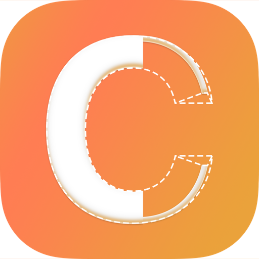

<div align="left">
  
</div>

# Contour Support

Welcome to Contour support! This repository is dedicated to help you get the most out of Contour and resolve any issues you might encounter.

## Table of Contents

- [Getting Help](#getting-help)
- [Frequently Asked Questions](#frequently-asked-questions)
- [Reporting Issues](#reporting-issues)
- [Feature Requests](#feature-requests)
- [Getting Started](#getting-started)
- [Models](#models)
- [Free vs Pro](#free-vs-pro)
- [Tips & Best Practices](#tips--best-practices)
- [Privacy & Security](#privacy--security)
- [Contact](#contact)

## Getting Help

If you need help with Contour, here are your options:

1. **Check the FAQ** below for common questions and answers
2. **Search existing issues** to see if your question has been answered
3. **Open a new issue** if you can't find what you're looking for
4. **Press ⌘/** in the app to view the built-in help screen

## Frequently Asked Questions

### What is Contour?

Contour is a native macOS app that turns Meta's Segment Anything models into a real desktop workspace. Drop a folder of images into a collection, type a prompt or draw a box, and get clean masks, bounding boxes, and labeled regions — exportable straight to COCO or YOLO, all without a single byte leaving your machine.

### Who is Contour for?

Contour is built for people who segment **a lot** of images and care about **how the masks come out**:

- **ML researchers & CV engineers** — building or curating training data for detection and segmentation models.
- **Annotation teams** — processing collections of images with consistent prompts and consistent settings.
- **Dataset creators** — producing clean COCO JSON or YOLO TXT exports without round-tripping through a web tool.
- **Designers & post-production artists** — extracting precise instance masks for compositing, masking, or roto work.
- **Researchers exploring SAM** — comparing model variants, quantizations, and prompting strategies side by side.

It is not a one-click background remover. It is a workstation tool for people who understand segmentation and want control over the prompt, the model, and the output format.

### Does Contour run on-device?

Yes — **100% on-device**. Every model runs locally via **MLX** — Apple's machine learning framework for Apple Silicon — with **Metal** for GPU compute and **Accelerate** for SIMD-accelerated mask composition. No cloud, no API key, no quota, no telemetry. Your client's unreleased imagery, research datasets, and confidential reference shots never leave the machine.

### What models are available?

Contour ships SAM 3 and SAM 3.1 in multiple precisions, downloaded once from Hugging Face's `mlx-community` namespace and cached locally:

| Model                       | Size            | Memory  | Notes                                                       |
| --------------------------- | --------------- | ------- | ----------------------------------------------------------- |
| **SAM 3** (full precision)  | ~1.7 GB         | 8 GB+   | Reliable baseline, fast on most Apple Silicon Macs          |
| **SAM 3.1** (full precision)| ~3.5 GB         | 16 GB+  | Latest model, supports box-geometry prompts                 |
| **Quantized variants**      | 450 MB – 900 MB | 8 GB+   | int8 / int6 / int5 / int4 — trade size and speed for accuracy |
| **Microscaling FP**         | 500 MB – 900 MB | 8 GB+   | mxfp8 / mxfp4 — modern low-precision floating point         |

A one-time license gate covers Meta's SAM acceptance; after that, downloads are silent. Nothing is shipped in the binary — you fetch only what you need.

### How do I get started?

1. **Create a collection** from the sidebar — drop images, a folder, or use the **+** button.
2. **Pick a model** in the toolbar (SAM 3 or SAM 3.1, plus a precision variant). First use downloads weights from Hugging Face.
3. **Prompt** — type a label (e.g. `"person, dog"`), or switch to the Box tool to drag include / exclude regions, then hit ⏎ or **Segment**.
4. **Tune** — drag confidence, NMS IoU, alpha, or minimum component area sliders. Re-renders instantly from cache.
5. **Run Batch** (Pro) to process the whole collection in one go.
6. **Export** — Mask PNG, Cutout PNG, COCO JSON, or YOLO TXT.

### How does prompting work?

Contour gives you three ways to tell the model what you want, all combinable on the same image:

- **Text prompts** — `"person"`, `"dog"`, `"label"`, anything SAM 3.x understands.
- **Include boxes** — drag a region to say *"more like this."*
- **Exclude boxes** — Shift-drag a region for *"and not this."*

The prompt picker also toggles between **Collection** mode (one prompt for every image in the batch) and **Override** mode (test a different prompt on a single image without affecting the rest).

### What are confidence, NMS IoU, alpha, and minimum component area?

The post-processing dials applied to cached raw model output — re-rendering takes hundreds of milliseconds, no re-inference required:

- **Confidence** — minimum score for a detection to be kept.
- **NMS IoU** — non-maximum suppression threshold; overlapping detections above this IoU are merged.
- **Alpha** — the soft cutoff applied to mask probabilities when generating the binary alpha channel.
- **Minimum component area** — drops connected components smaller than this many pixels (kills speckle from noisy masks).

Tune until the contours look right on a representative image, then commit to a batch.

### What overlay modes are available?

Three views, switchable from the toolbar without re-running inference:

- **Pixel mask** — the alpha channel itself, for cutouts and matting.
- **Bounding box** — axis-aligned rectangles, for COCO-style detection datasets.
- **Oriented bounding box (OBB)** — rotated rectangles, for YOLO-OBB and aerial / document workflows.

Up to 200 detections per image, browsable as a sortable list with arrow-key navigation alongside the canvas.

### What export formats does Contour support?

- **Mask PNG** — binary alpha channels (free).
- **Cutout PNG** — transparent background, ready for compositing (free).
- **COCO JSON** (Pro) — bounding boxes, RLE masks, or polygons; with optional source-image copy.
- **YOLO TXT** (Pro) — bbox or polygon, with **Ramer–Douglas–Peucker** simplification and class mappings.

You pick the destination folder, opt into the source-image copy, and the exporter writes the labels alongside (or independent of) the source layout.

### Why is SAM 3.1 so much bigger than SAM 3?

SAM 3.1 is a larger, more capable model (~3.5 GB vs ~1.7 GB) with better quality on fine edges and the only variant that supports **box-geometry prompting**. If you don't need that, SAM 3 (or any of its quantized variants down to 450 MB at INT4) will handle most jobs at a fraction of the download.

### How do I uninstall a model I no longer need?

Open **Settings → Models**, find the model in the list, and click the trash icon. The weights are removed from disk immediately. Re-download at any time from the same screen.

### Does Contour require internet access?

Only for the **initial model download** from Hugging Face. Once you've downloaded the SAM variants you want, Contour runs entirely offline — no telemetry, no license-check calls, no cloud inference. Anonymous HTTPS asset fetches only, when you choose to download.

### What macOS version is required?

Contour requires **macOS 14 (Sonoma) or later** running on **Apple Silicon** (M1 or newer). MLX targets the unified-memory GPU and Neural Engine on M-series chips — Intel Macs are not supported. **8 GB unified memory** is the minimum for quantized SAM 3; **16 GB+** recommended for full-precision SAM 3.1.

### How much does Contour cost?

Contour is **free to download** and free for single-image segmentation with every SAM variant — including all the export-to-PNG flows. A one-time **Pro unlock** (in-app purchase) enables batch processing across collections and dataset exports (COCO JSON, YOLO TXT) — see [Free vs Pro](#free-vs-pro) below. Pro is tied to your Apple ID and works on every Mac signed into the same account.

## Reporting Issues

Found a bug? Please help us improve Contour by reporting it!

### Before Reporting

1. **Update to the latest version** — your issue might already be fixed
2. **Search existing issues** — someone might have already reported it
3. **Try to reproduce** — can you make it happen consistently?
4. **Check the Console** — open Console.app and filter for `Contour` to see error logs

### Creating a Good Issue Report

When reporting a bug, please include:

- **Contour version** (found in About Contour or the Help screen)
- **macOS version** (e.g., macOS 15.2)
- **Mac model** (e.g., MacBook Pro M3, Mac Studio M2 Max, Mac mini M4)
- **Model used** (e.g., SAM 3 INT4, SAM 3.1 BF16, SAM 3 MXFP4)
- **Prompt type** (text, include box, exclude box, or combination)
- **Steps to reproduce** the issue
- **Expected behavior** — what should happen?
- **Actual behavior** — what actually happened?
- **Screenshots** — before / after segmentations are especially helpful for mask-quality issues
- **Console logs** — filter for `Contour` in Console.app

> 💡 The easiest way is to use **Help → Report an Issue** (or the "Report an Issue" button on the Help screen). It opens a pre-filled GitHub issue with your app version, macOS version, and Mac model already included.

**Example:**

```markdown
**Contour Version:** 1.0.0
**macOS Version:** 15.2
**Mac:** MacBook Pro M3 (16 GB)
**Model:** SAM 3.1 BF16
**Prompt:** "person" + 1 include box

**Steps to Reproduce:**

1. Create a collection with 200 portraits
2. Set Confidence to 0.4, NMS IoU to 0.7
3. Run Batch

**Expected:** All 200 images segmented with consistent person masks
**Actual:** Images 173–200 fail with "out of memory" after ~12 minutes

**Console Logs:**
[Paste relevant console output]
```

## Feature Requests

Have an idea to make Contour better? We'd love to hear it!

When suggesting a feature:

1. **Check existing feature requests** — use the search function
2. **Describe the use case** — what are you trying to achieve?
3. **Provide examples** — sample images, prompts, target export formats, or mockups help
4. **Explain the benefit** — how does this help other users?

Mask-quality reports are especially welcome — if a specific class or scene type (small objects, dense crowds, fine detail, transparent materials) is giving SAM trouble, a small before/after with the prompt and model variant goes a long way.

## Getting Started

### Installation

1. Download Contour from the Mac App Store
2. Launch Contour from Applications
3. Open **Settings → Models** and download a SAM variant — `SAM 3 (4-bit)` (~450 MB) is the smallest runnable starting point. The first download requires accepting Meta's SAM License via an in-app sheet.

### First Use

1. Click the **+** button in the sidebar to create your first collection
2. Drag images or a folder into the collection
3. Pick a model and precision from the toolbar
4. Type a text prompt (e.g. `"person, dog"`) or switch to the Box tool and drag include / exclude regions
5. Hit ⏎ or click **Segment** to run on the selected image
6. Tune confidence, NMS IoU, alpha, and minimum component area inline — re-renders are instant from cache
7. Use the Export menu to save masks or cutouts — or unlock Pro to run Batch and export COCO / YOLO across the whole collection

### Keyboard Shortcuts

| Shortcut | Action          |
| -------- | --------------- |
| **⌘,**   | Open Settings   |
| **⌘/**   | Open Help       |
| **⌘Q**   | Quit Contour    |
| **⏎**    | Segment current image |
| **Shift-drag** | Draw exclude box |

### Canvas Gestures

| Gesture                | Action                          |
| ---------------------- | ------------------------------- |
| Scroll                 | Pan                             |
| **⌥** + scroll         | Zoom, anchored on cursor        |
| Drag                   | Draw an include box             |
| **⇧** + drag           | Draw an exclude box             |
| Click in detection list| Highlight that instance on the canvas |

## Models

### SAM 3

- Meta's Segment Anything Model 3
- Full precision (~1.7 GB) plus quantized variants (INT8, INT6, INT5, INT4) and microscaling FP (MXFP8, MXFP4) from 450 MB up
- Strong general-purpose segmentation, fast on 8 GB Apple Silicon Macs
- Supports text prompts and include / exclude boxes
- License: Meta SAM License — accepted in-app before the first download
- Best for: most workflows where speed and footprint matter more than the absolute ceiling on quality

### SAM 3.1

- Meta's Segment Anything Model 3.1 — the latest in the family
- Full precision (~3.5 GB), 16 GB+ unified memory recommended
- State-of-the-art segmentation quality and the only variant that supports **box-geometry prompting**
- Supports text prompts, include / exclude boxes, and richer geometric prompts
- License: Meta SAM License — accepted in-app before the first download
- Best for: hero work, dataset golden sets, fine-edge instances, and anywhere you need the best mask SAM can produce

### Quantization & Precision

| Precision | Size     | Notes                                                |
| --------- | -------- | ---------------------------------------------------- |
| **F32**   | full     | Reference precision                                  |
| **BF16**  | ~½ full  | Lossless-feeling on most subjects, half the memory   |
| **INT8**  | smaller  | Affine quantization — mild quality cost              |
| **INT6**  | smaller  | More aggressive — visible cost on fine edges         |
| **INT5**  | smaller  | For tight-disk situations                            |
| **INT4**  | smallest | ~450 MB on SAM 3 — runs on 8 GB Macs                 |
| **MXFP8** | small    | Microscaling FP — modern alternative to INT8         |
| **MXFP4** | small    | Microscaling FP — modern alternative to INT4         |

Color-coded precision badges in the toolbar mean you always know what's loaded.

## Free vs Pro

Contour is free to download. A one-time **Pro** in-app purchase unlocks batch processing and dataset exports. Pro is tied to your Apple ID and works on all your Macs signed into the same account.

### Free

- ✅ All SAM 3 and SAM 3.1 variants (full precision, quantized, microscaling FP)
- ✅ Single-image segmentation with full prompt and tuning controls
- ✅ Text prompts, include boxes, and exclude boxes (Shift-drag), combinable
- ✅ Confidence, NMS IoU, alpha, minimum component area sliders — instant re-render from cache
- ✅ Three overlay modes: pixel mask, bounding box, oriented bounding box
- ✅ Up to 200 detections per image, sortable list, arrow-key navigation
- ✅ Export single images to **Mask PNG** and **Cutout PNG** (transparent background)
- ✅ Collections for organizing images (browse-only)

### Pro

Everything in Free, plus:

- 🔓 **Run Batch** on any collection — process the full set in one click
- 🔓 Crash-safe, resumable batches that skip already-segmented images
- 🔓 **COCO JSON** export — bounding boxes, RLE masks, or polygons
- 🔓 **YOLO TXT** export — bbox or polygon, with Ramer–Douglas–Peucker simplification
- 🔓 Optional source-image copy alongside the labels, configurable destination folder
- 🔓 All future Pro features

> 🔁 **Family Sharing:** your Pro unlock is shared with up to five family members in your Family Sharing group.

## Tips & Best Practices

### Pick the Right Model and Precision

Not every job needs SAM 3.1 BF16. For most batches, **SAM 3 INT4 or MXFP4** is fast, fits in 8 GB, and produces excellent masks. Reach for **SAM 3.1** when edge quality really matters — fine instances, dense scenes, or when you specifically need box-geometry prompting. Matching the model to the subject saves time, memory, and disk.

### Tune on One, Then Batch

Always select one representative image and dial in your prompt and tuning sliders (confidence, NMS IoU, alpha, minimum component area) before running a batch. Re-running a batch on 500 images because the confidence was too low is a slow way to learn what a good threshold looks like. Tuning re-renders from cache in milliseconds — it's effectively free.

### Prompt Composition

Text alone gets you most of the way. **Include boxes** are great for "this kind of region, but specifically *here*." **Exclude boxes** clean up known false positives — a piece of background that keeps getting picked up, or a person in the corner you don't care about. Combining text with one or two boxes usually beats either alone.

### Use Collection vs Override Prompt

**Collection prompt** is the one prompt that runs on every image in a batch. **Override** lets you test a different prompt on a single image without affecting the rest. Use Override to validate a tricky image *before* running the batch — once you commit, the Collection prompt is what runs on the whole set.

### Cache-Aware Iteration

Contour caches raw model output per image. When you change a tuning slider (confidence, NMS, alpha, area), only the post-processing re-runs — the model isn't called again. Use this to iterate quickly: tweak one dial, inspect the contours, repeat. You only pay for inference when the prompt or the model changes.

### Match Export Format to Your Pipeline

- **Mask PNG** — for cutout, matting, or downstream tools that expect a binary alpha channel
- **Cutout PNG** — for compositing, design, mockups
- **COCO JSON (RLE)** — for instance segmentation training (Mask R-CNN, Detectron2, mmdetection)
- **COCO JSON (polygon)** — for tools that want vector boundaries
- **YOLO TXT (bbox)** — for YOLOv5/v8/v11 detection training
- **YOLO TXT (polygon, RDP simplified)** — for YOLO-Seg with reasonable file sizes

### Skip Already-Done Images on Re-Runs

Batches skip already-segmented images by default. If you change a prompt or model and want to re-run, use **Clear Result** on the affected images first — it discards the segmentation (memory + on-disk cache) while preserving prompts and boxes for the next run.

## Privacy & Security

### What Contour Does

- ✅ Runs every model on your Mac via MLX, Metal, and Accelerate
- ✅ Reads images from locations you explicitly choose
- ✅ Writes masks, cutouts, and dataset exports to destinations you explicitly choose
- ✅ Downloads SAM checkpoints from Hugging Face's `mlx-community` namespace over standard HTTPS
- ✅ Runs entirely in the macOS App Sandbox

### What Contour Does NOT Do

- ❌ Never uploads your images to any server — not for inference, not for "improvement," not ever
- ❌ Never requires an account, login, or activation key
- ❌ Never collects telemetry or analytics
- ❌ Never calls home for license checks once Pro is unlocked
- ❌ Never sends prompts, masks, or detections off-device

### Privacy

Contour is built privacy-first:

- **No accounts** — you don't sign in to anything
- **No telemetry** — we don't collect any usage data
- **No analytics** — we don't track what you do
- **No third-party services** — no external analytics, crash reporters, or A/B testing SDKs
- **No cloud inference** — every model runs locally on your Mac

See the full [Privacy Policy](https://contour.mgcrea.io/privacy) for details.

### Security

- **App Sandbox** — Contour runs in the macOS App Sandbox with minimal entitlements
- **No admin required** — never requires admin or root privileges
- **Network isolation** — the only outgoing connection is the Hugging Face model-download CDN, and only when you choose to download a model
- **License-gated downloads** — Meta's SAM License is shown in-app and must be accepted before the first SAM download
- **Open-source runtime** — MLX Swift is MIT-licensed; SAM 3 / SAM 3.1 weights are governed by the Meta SAM License

### Data Storage

Your data lives in two places:

1. **Local app container** — collection metadata, prompts, per-image segmentation state, and cached raw model output
2. **Model cache** — downloaded SAM checkpoints (`~/Library/Containers/io.mgcrea.contour/`)

Your source images are never copied into the container — they're read directly from the locations you add them from, on demand. Cached results can be cleared per image (Clear Result) or wholesale from the model and output settings.

## Contact

- **Download:** Mac App Store
- **Website:** [contour.mgcrea.io](https://contour.mgcrea.io/)
- **Issues & Bug Reports:** [GitHub Issues](https://github.com/mgcrea/support/issues/new?labels=contour&title=%5Bcontour%5D+)
- **Feature Requests:** [GitHub Issues](https://github.com/mgcrea/support/issues/new?labels=contour&title=%5Bcontour%5D+)
- **Email:** [support@mgcrea.io](mailto:support@mgcrea.io)
- **In-App Help:** Press **⌘/** in Contour

---

**Made with ❤️ for ML researchers, CV engineers, annotation teams, and anyone who needs precise, prompt-driven instance masks.**

_Contour uses Meta's Segment Anything Models (SAM 3 and SAM 3.1) under the Meta SAM License, distributed via Hugging Face's `mlx-community` namespace. MLX Swift is MIT-licensed (Apple, ml-explore). Contour is not affiliated with Meta, Apple, or Hugging Face._
