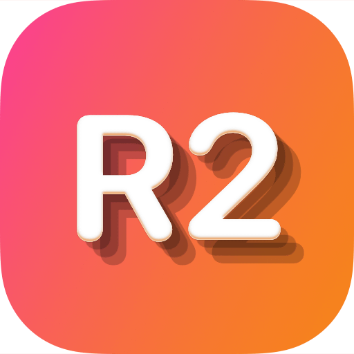

<div align="left">
  <a href="https://apps.apple.com/app/id6761668362">
    
  </a>
</div>

# R2Explorer Support

[](https://apps.apple.com/app/id6761668362)

Welcome to R2Explorer support! This repository is dedicated to help you get the most out of R2Explorer and resolve any issues you might encounter.

## Table of Contents

- [Getting Help](#getting-help)
- [Frequently Asked Questions](#frequently-asked-questions)
- [Reporting Issues](#reporting-issues)
- [Feature Requests](#feature-requests)
- [Getting Started](#getting-started)
- [Supported Providers](#supported-providers)
- [Free vs Pro](#free-vs-pro)
- [Tips & Best Practices](#tips--best-practices)
- [Privacy & Security](#privacy--security)
- [Contact](#contact)

## Getting Help

If you need help with R2Explorer, here are your options:

1. **Check the FAQ** below for common questions and answers
2. **Search existing issues** to see if your question has been answered
3. **Open a new issue** if you can't find what you're looking for
4. **Press ⌘/** in the app to view the built-in help screen

## Frequently Asked Questions

### What is R2Explorer?

R2Explorer is a native macOS app for browsing and managing object storage on [Cloudflare R2](https://developers.cloudflare.com/r2/) and any S3-compatible provider (AWS S3, Backblaze B2, MinIO, Tigris, Wasabi, …). It offers a fast, tabbed UI with drag-and-drop uploads, inline previews, bulk operations, and cross-provider sync — designed to feel right at home on macOS.

### How do I connect to my Cloudflare R2 account?

1. In the [Cloudflare dashboard](https://dash.cloudflare.com/?to=/:account/r2/api-tokens), go to **R2 → Manage R2 API Tokens** and create a token with read/write permissions on the buckets you want to browse
2. In R2Explorer, click the **+** button in the sidebar and choose **Cloudflare R2**
3. Enter your **Account ID**, **Access Key ID**, and **Secret Access Key**
4. Your buckets will appear automatically once authenticated

### Can I connect to AWS S3 or other S3-compatible providers?

Yes. Choose **S3-Compatible** when adding a connection and enter the endpoint URL, access key ID, and secret access key from your provider. R2Explorer speaks the standard S3 protocol and works with AWS S3, Backblaze B2, MinIO, Tigris, Wasabi, and anything else that implements it.

### Where are my API credentials stored?

All credentials are stored securely in the **macOS Keychain**. They are never sent to our servers or any third party — only to Cloudflare's R2 API or the S3-compatible endpoint you configured.

### What file types can R2Explorer preview?

Images, JSON, XML, YAML, and source code files preview directly in the app. For unsupported types, download the object and open it with the appropriate Mac application. You can also inspect HTTP headers and object metadata without downloading.

### How do uploads work for large files?

Drag-and-drop any file onto the object browser to upload. R2Explorer automatically splits large files into multipart uploads, so files of any size work reliably and can be retried if a part fails.

### What is Bucket Mirror & Sync?

**Sync** copies objects between two buckets — new and changed files only. **Mirror** goes further and also deletes extras on the destination so it matches the source exactly. It works across connections and across providers (R2 ↔ S3), with optional source and destination prefixes if you want to move a sub-folder. You always see a full plan before anything is written.

### What is Bucket Benchmark?

A built-in performance test for any bucket. It measures upload, download, TTFB (time-to-first-byte), and list throughput with file sizes from 1 KB to 10 MB, reports latency percentiles (min, avg, p50, p95, max) and throughput in MB/s, and cleans up its test objects automatically.

### What should I check if the app cannot connect?

Please verify the following:

- Your API credentials are **valid and not expired or revoked**
- Your token has the **required R2 permissions** (or the equivalent S3 IAM permissions)
- Your **internet connection** is working
- Cloudflare's API is not experiencing an outage — check [Cloudflare Status](https://www.cloudflarestatus.com)

### Can I use R2Explorer offline?

No — R2Explorer talks directly to the Cloudflare R2 API or your S3 endpoint, so an active internet connection is required.

### What macOS version is required?

R2Explorer requires **macOS 26 (Tahoe) or later**, running on an Apple Silicon or Intel Mac.

### How much does R2Explorer cost?

R2Explorer is **free to download** and free to use for browsing, previewing, and downloading objects. A one-time **Pro unlock** (in-app purchase) enables every write operation — see [Free vs Pro](#free-vs-pro) below.

## Reporting Issues

Found a bug? Please help us improve R2Explorer by reporting it!

### Before Reporting

1. **Update to the latest version** — your issue might already be fixed
2. **Search existing issues** — someone might have already reported it
3. **Try to reproduce** — can you make it happen consistently?
4. **Check the Console** — open Console.app and filter for `R2Explorer` or `SwiftR2` to see error logs

### Creating a Good Issue Report

When reporting a bug, please include:

- **R2Explorer version** (found in About R2Explorer or the Help screen)
- **macOS version** (e.g., macOS 26.1)
- **Provider** (Cloudflare R2, AWS S3, Backblaze B2, MinIO, …)
- **Steps to reproduce** the issue
- **Expected behavior** — what should happen?
- **Actual behavior** — what actually happened?
- **Screenshots** — if applicable
- **Console logs** — filter for `R2Explorer` / `SwiftR2` in Console.app

> 💡 The easiest way is to use **Help → Report an Issue** (or the "Report an Issue" button on the Help screen). It opens a pre-filled GitHub issue with your app and macOS version already included.

**Example:**

```markdown
**R2Explorer Version:** 1.3.0
**macOS Version:** 26.1
**Provider:** Cloudflare R2

**Steps to Reproduce:**

1. Open a bucket with 10,000+ objects
2. Select a folder containing 500 files
3. Right-click → Rename folder

**Expected:** Rename sheet with live progress
**Actual:** Progress stalls at 50%, no error surfaced

**Console Logs:**
[Paste relevant console output]
```

## Feature Requests

Have an idea to make R2Explorer better? We'd love to hear it!

When suggesting a feature:

1. **Check existing feature requests** — use the search function
2. **Describe the use case** — why do you need this feature?
3. **Provide examples** — how would it work?
4. **Explain the benefit** — how does this help other users?

## Getting Started

### Installation

1. Download R2Explorer from the [Mac App Store](https://apps.apple.com/app/id6761668362)
2. Launch R2Explorer from Applications

### First Use

1. Click the **+** button in the sidebar to add a connection
2. Choose your provider:
   - **Cloudflare R2** — enter your Account ID, Access Key ID, and Secret Access Key
   - **S3-Compatible** — enter the endpoint URL plus access key ID and secret access key
3. Select a bucket from the list to browse objects
4. Explore freely — any destructive or write actions are gated behind Pro until unlocked

### Creating a Cloudflare R2 API Token

1. Visit [Cloudflare Dashboard → R2 → Manage R2 API Tokens](https://dash.cloudflare.com/?to=/:account/r2/api-tokens)
2. Click **Create API Token**
3. Choose **Object Read & Write** (or **Read only** for browse-only access) and scope it to the buckets you want R2Explorer to access
4. Copy the **Access Key ID** and **Secret Access Key** into R2Explorer

See Cloudflare's [Create API Token guide](https://developers.cloudflare.com/fundamentals/api/get-started/create-token/) for more detail.

### Keyboard Shortcuts

| Shortcut | Action        |
| -------- | ------------- |
| **⌘T**   | New Tab       |
| **⌘/**   | Open Help     |
| **⌘,**   | Open Settings |
| **⌘Q**   | Quit          |

## Supported Providers

### Cloudflare R2

- Connect via Account ID + Access Key ID + Secret Access Key (all stored in the macOS Keychain)
- List and switch between buckets on the same account
- Browse objects with folder hierarchy, breadcrumbs, sorting, search, and multi-select
- Upload, download, rename, and delete (Pro)
- Create and delete buckets with location hints and storage classes (Pro)

### S3-Compatible

- Works with AWS S3, Backblaze B2, MinIO, Tigris, Wasabi, and any provider that implements the S3 protocol
- Enter the endpoint URL + access key ID + secret access key
- Same browsing, previewing, and write capabilities as R2 connections
- Cross-provider Mirror & Sync works between any two connections regardless of provider

## Free vs Pro

R2Explorer is free to download. A one-time **Pro** in-app purchase unlocks every write operation. Pro is tied to your Apple ID and works on all your Macs signed into the same account.

### Free

- ✅ Connect unlimited Cloudflare R2 and S3-compatible accounts
- ✅ Browse buckets (folder view, breadcrumbs, sorting, search, multi-select)
- ✅ Preview images, JSON, XML, YAML, and source files inline
- ✅ Inspect HTTP headers and object metadata
- ✅ Download single objects, bulk selections, or entire folders
- ✅ Multi-tab UI, keyboard shortcuts

### Pro

Everything in Free, plus:

- 🔓 Drag-and-drop uploads with automatic multipart handling
- 🔓 Delete objects, folders, and bulk selections with live progress
- 🔓 Rename files and folders (with parallel copy-then-delete and one-click rollback)
- 🔓 Create and delete buckets (with location hints and storage classes)
- 🔓 Bucket Mirror & Sync across connections and providers
- 🔓 Bucket Benchmark (upload / download / TTFB / list, p50–p95)

> 🎁 **Grandfathering:** users who originally purchased R2Explorer as a paid app (before the free + Pro pivot) get Pro automatically on upgrade — no extra purchase required.

## Tips & Best Practices

### Review the Plan Before You Sync

Mirror & Sync always generates a full plan — adds, updates, and (for Mirror) deletes — before writing anything. Scan it before confirming, especially when Mirror is enabled, because Mirror **deletes objects on the destination** that aren't on the source. For your first cross-provider sync, try Sync mode first.

### Use Tabs for Multi-Bucket Workflows

Press **⌘T** to open multiple tabs. Great for:

- Comparing two buckets side by side
- Keeping a source bucket open while previewing the destination
- Watching a long upload in one tab while browsing another

### Tune Concurrency to Your Provider

Bulk delete, upload, and sync run in parallel batches. You can set concurrency from 1 to 16 in the progress sheet or Settings — bump it up on R2, dial it down if your S3-compatible provider starts rate-limiting.

### Scope Tokens Narrowly

Create an R2 API token with just the buckets and permissions you actually need. If the token is ever exposed, the blast radius stays small, and you can revoke it independently of your other tokens.

### Benchmark Before Large Migrations

Before mirroring a bucket with millions of objects or tens of gigabytes, run **Bucket Benchmark** on the source and destination. Comparing p50 and p95 upload / download latency across providers will give you a realistic ETA and catch obvious misconfiguration.

### Check the Cloudflare Status Page First

If R2 connections suddenly start failing, check [cloudflarestatus.com](https://www.cloudflarestatus.com) before assuming something is wrong with the app or your token.

## Privacy & Security

### What R2Explorer Does

- ✅ Talks to the Cloudflare R2 API or your S3 endpoint directly from your Mac
- ✅ Stores API credentials in the **macOS Keychain**
- ✅ Reads and writes objects you explicitly act on
- ✅ Runs entirely in the macOS App Sandbox

### What R2Explorer Does NOT Do

- ❌ Never sends your credentials to any server other than Cloudflare or your configured S3 endpoint
- ❌ Never sends your object contents to any third party
- ❌ Never collects telemetry or analytics
- ❌ Never requires admin/root privileges

### Privacy

R2Explorer is committed to your privacy:

- **No telemetry** — we don't collect any usage data
- **No analytics** — we don't track what you do
- **No third-party tracking** — no external analytics services
- **Keychain-backed secrets** — credentials stay in the macOS Keychain
- **Direct-to-provider** — the only network destinations are the endpoints you configure

See the full [Privacy Policy](https://r2-explorer.mgcrea.io/privacy) for details.

### Security

- **App Sandbox** — R2Explorer runs in the macOS App Sandbox with minimal entitlements
- **No admin required** — never requires admin or root privileges
- **Network isolation** — only outgoing connections to the endpoints you configure
- **No code execution** — never executes downloaded scripts or binaries

### Data Storage

Your data lives in two places:

1. **Local app container** — connection metadata and preferences
2. **macOS Keychain** — API credentials (encrypted by macOS)

Object contents are not copied or cached locally; they're read directly from the R2 / S3 endpoint on demand. Downloads and uploads go to and from the locations you choose in the filesystem.

## Contact

- **Download:** [Mac App Store](https://apps.apple.com/app/id6761668362)
- **Website:** [r2-explorer.mgcrea.io](https://r2-explorer.mgcrea.io/)
- **Issues & Bug Reports:** [GitHub Issues](https://github.com/mgcrea/support/issues/new?labels=r2-explorer&title=%5Br2-explorer%5D+)
- **Feature Requests:** [GitHub Issues](https://github.com/mgcrea/support/issues/new?labels=r2-explorer&title=%5Br2-explorer%5D+)
- **Email:** [support@mgcrea.io](mailto:support@mgcrea.io)
- **In-App Help:** Press **⌘/** in R2Explorer

---

**Made with ❤️ for developers who want a native Mac experience for Cloudflare R2 and S3**

_R2Explorer is not affiliated with Cloudflare or Amazon Web Services. "Cloudflare" and "R2" are trademarks of Cloudflare, Inc. "Amazon S3" is a trademark of Amazon.com, Inc._
