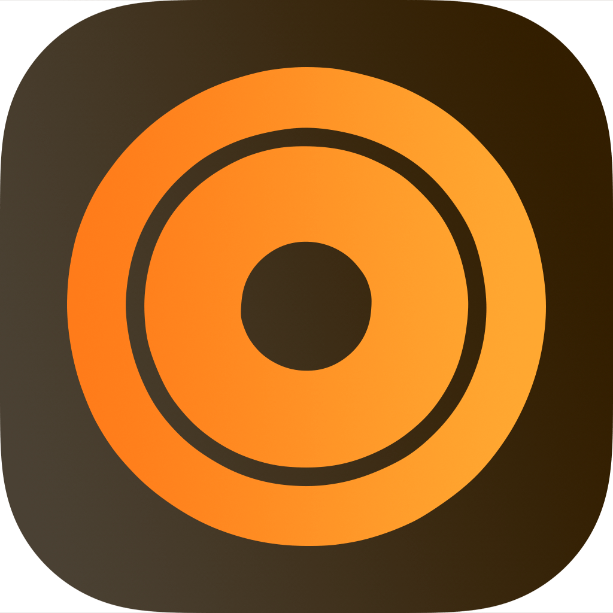

<div align="left">
  
</div>

# RXd Support

Welcome to RXd support! This page covers the most common questions, how to report bugs, and where to find help with the app.

## Table of Contents

- [Getting Help](#getting-help)
- [Frequently Asked Questions](#frequently-asked-questions)
- [Reporting Issues](#reporting-issues)
- [Feature Requests](#feature-requests)
- [Getting Started](#getting-started)
- [Workout Categories](#workout-categories)
- [Free vs Pro](#free-vs-pro)
- [Tips & Best Practices](#tips--best-practices)
- [Privacy & Security](#privacy--security)
- [Contact](#contact)

## Getting Help

If you need help with RXd, here are your options:

1. **Check the FAQ** below for common questions and answers
2. **Search existing issues** to see if your question has been answered
3. **Open a new issue** if you can't find what you're looking for
4. **Email support** at [support@mgcrea.io](mailto:support@mgcrea.io) for anything you'd rather not file publicly

## Frequently Asked Questions

### What is RXd?

RXd is a native iOS workout tracker built for athletes who train hard and want to log every detail — strength sessions, conditioning, and named benchmarks — with the speed and polish of a real Apple app. Drop into a workout, dial in your sets and reps with native pickers, and watch your training history build up month by month, all on your iPhone, all offline.

### Who is RXd for?

RXd is built for the people who actually open a notebook between sets:

- **CrossFit athletes** — track benchmark times across the year and see your scores on Fran, Murph, Helen, DT, and the rest
- **Strength athletes** — log focus lifts and complex sessions cycle after cycle, with set-by-set rep and weight tracking
- **Hybrid trainees** — mix strength, cardio, and benchmarks in a single log without fighting the app's mental model
- **Coaches** — keep a clean, exportable record of what was done and at what weight

It is not a generic step counter or a guided-program app. It is a fast, private, native log for athletes who already know what they want to do today and just want to record it cleanly.

### Does RXd run on-device?

Yes — **100% on-device**. RXd has no backend, no account system, no login, no cloud sync, no analytics, and no crash-reporting SDK. Workout data is persisted locally with MMKV and never leaves your iPhone. The only network surface in the app is Apple's StoreKit, used solely to fetch and validate the Pro in-app purchase.

The App Privacy form on the App Store reads "Data Not Collected" because that is literally true.

### What workout types can I log?

Three categories, each tuned to how that style of training is actually tracked:

| Category      | What you log                                      | Notes                                                                   |
| ------------- | ------------------------------------------------- | ----------------------------------------------------------------------- |
| **Strength**  | Movement, sets, reps, weight                      | Focus lifts and complex sessions across barbell / dumbbell / kettlebell |
| **Cardio**    | Movement, distance, time, calories, custom target | Pick the metric that matters for the workout                            |
| **Benchmark** | Named workout, time or score, optional notes      | The Girls and the Heroes come pre-configured                            |

### Which benchmark workouts come pre-configured?

The classic CrossFit benchmarks ship with movement specs and rep schemes already filled in:

- **The Girls** — Fran, Elizabeth, Nancy, Lynne, and more
- **The Heroes** — Murph, DT, Randy, Coe, and more

Drop in your time or score and you're done. No setting up movement lists, no guessing rep counts.

### How does the 1RM Calculator work?

Pick any set you've logged (or punch in a hypothetical), choose one of four formulas — **Epley**, **Brzycki**, **Wathan**, or **Adaptive** — and RXd predicts your one-rep max. You can also turn the prediction directly into a workout template, so the next session is one tap away.

| Formula      | Best for                                                                                         |
| ------------ | ------------------------------------------------------------------------------------------------ |
| **Epley**    | Linear, the de-facto standard. Stable across 1–15 reps; slightly aggressive past 10.             |
| **Brzycki**  | Most accurate at low reps (≤5). Past 10 reps the formula breaks down and those sets are skipped. |
| **Wathan**   | Exponential model, validated up to ~20 reps. Best when working sets go above 10.                 |
| **Adaptive** | Epley for ≤10 reps, Wathan above. Recommended if your sets span low and high rep ranges.         |

### What does Targets & PRs track?

Personal records by movement (1RM, 3RM, 5RM) and a comparison against bodyweight strength standards so you can see where you stand without leaving the app. Pro users can set **custom targets** per movement on top of the built-in standards.

### How long does workout history go back?

- **Free** — last 30 days, grouped by month and filterable by category
- **Pro** — unlimited history, all the way back to your first logged workout

### How do I export my data?

CSV export is a Pro feature. Open **Settings → Export** and choose the date range; RXd writes a CSV with one row per set, ready to drop into Numbers, Excel, or a spreadsheet of your choice.

Free users always own their data — it lives in your local app container and is included in your iCloud iPhone backup. CSV export just makes it portable to other tools.

### Does RXd sync between my iPhone and iPad?

Not today. RXd runs entirely on-device with no cloud sync, so each device keeps its own log. Apple's automatic iPhone-to-iPad app installs work, but workouts logged on one device do not appear on the other. iCloud-based sync is on the roadmap.

### Does RXd integrate with Apple Health?

Not in the current build. Apple Health (HealthKit) read/write is a tracked roadmap item but not shipped yet. Workouts logged in RXd stay inside RXd until that integration lands.

### What units does RXd support?

Both **metric** (kg, km) and **imperial** (lb, mi). You set your preference during onboarding and can change it any time in **Settings → Units**. Conversion is automatic — change the unit and existing workouts are displayed in the new unit immediately.

### What iOS version is required?

RXd runs on **iOS 15.1 or later** on iPhone and iPad. iPad is supported in landscape and portrait. Newer iOS versions get the full polish (Dynamic Type, latest SF Symbols, fluid New Architecture animations) but RXd works cleanly all the way back to iOS 15.

### How much does RXd cost?

RXd is **free to download** with no trial timer, no account, and no paywall on the core logging experience. A one-time **Pro unlock** (in-app purchase) removes the 30-day history cap, enables custom targets per movement, and unlocks CSV export. See [Free vs Pro](#free-vs-pro) below.

Pro is **non-consumable** — pay once, own it forever — and is **Family Sharing-eligible**, so a single purchase covers up to five family members in your Family Sharing group.

### I installed RXd before the Pro launch. Do I have to pay?

**No.** Athletes who installed RXd before the Pro IAP launched (app version 1.4.0) are **grandfathered in automatically** and unlock as Pro the first time they open a Pro-era build. Thanks for being an early user — this one's on us.

### How do I restore Pro on a new iPhone?

Sign in to the same Apple ID you used to purchase, install RXd from the App Store, and either re-tap **Unlock Pro** (StoreKit recognizes your existing entitlement and unlocks instantly) or use **Settings → Pro → Restore Purchases**.

### Is there a refund policy?

Refunds are handled by Apple — open [reportaproblem.apple.com](https://reportaproblem.apple.com) within 14 days of purchase, find your RXd Pro receipt, and request a refund directly from Apple. We don't process refunds on our side because Apple owns the transaction.

## Reporting Issues

Found a bug? Please help us improve RXd by reporting it!

### Before Reporting

1. **Update to the latest version** — your issue might already be fixed
2. **Search existing issues** — someone might have already reported it
3. **Try to reproduce** — can you make it happen consistently?
4. **Force-quit and relaunch** — swipe RXd off the app switcher, reopen, and confirm the issue still happens

### Creating a Good Issue Report

When reporting a bug, please include:

- **RXd version** (Settings → About, or the bottom of the Settings tab)
- **iOS version** (e.g., iOS 18.4)
- **Device model** (e.g., iPhone 16 Pro, iPhone 13 mini, iPad Air M2)
- **Workout category involved** (Strength, Cardio, Benchmark, or N/A)
- **Steps to reproduce** the issue
- **Expected behavior** — what should happen?
- **Actual behavior** — what actually happened?
- **Screenshots or screen recording** — gold-standard for UI issues

> 💡 The fastest path is **Settings → Report an Issue** in the app — it opens a pre-filled GitHub issue with your app version, iOS version, and device model already included.

**Example:**

```markdown
**RXd Version:** 1.4.0 (build 261)
**iOS Version:** 18.4
**Device:** iPhone 16 Pro
**Category:** Strength

**Steps to Reproduce:**

1. Tap + on the Strength tab
2. Pick "Back Squat" as the focus lift
3. Open the weight picker, scroll past 200 kg
4. Confirm the set

**Expected:** Set saves with the selected weight
**Actual:** Picker snaps back to 100 kg when I close it
```

## Feature Requests

Have an idea to make RXd better? We'd love to hear it!

When suggesting a feature:

1. **Check existing feature requests** — use the search function on the issue tracker
2. **Describe the use case** — what are you trying to log, and why is it awkward today?
3. **Provide examples** — sample workouts, reference apps, or sketches help
4. **Explain the benefit** — does this help one specific category of athlete or everyone?

Especially welcome: requests for new pre-configured benchmark workouts (with movement specs and rep schemes), additional 1RM formulas, and import formats from other tracking apps.

## Getting Started

### Installation

1. Download RXd from the [App Store](https://apps.apple.com/app/id6745904823)
2. Launch RXd from your home screen
3. Walk through onboarding (~60 seconds): pick units (metric or imperial), set your fitness level, enter your bodyweight

No account, no email, no Sign in with Apple. Onboarding writes to local storage and you're in.

### First Use

1. Pick a tab — **Strength**, **Cardio**, or **Benchmark**
2. Tap **+** to start a new workout
3. Choose a movement (or a named benchmark like Fran or Murph)
4. Use the native pickers to dial in sets, reps, weight, time, or distance
5. Save — your workout appears in **History**, grouped by month

### Onboarding Reset

If you want to walk through onboarding again (for example after handing your phone to someone else briefly), open **Settings → Reset Onboarding**. Your workouts are kept; only the onboarding flag is cleared.

## Workout Categories

### Strength

Two flavors of strength session:

- **Focus lift** — a single movement (Back Squat, Deadlift, Bench Press, Snatch, etc.) with set-by-set rep and weight tracking
- **Complex** — a sequence of movements (e.g., Power Clean → Front Squat → Push Jerk) logged as one session

Imperial (lb) and metric (kg) are interchangeable per workout — the picker respects your default but lets you override on the spot.

### Cardio

Pick a movement (Run, Row, Bike, Ski, Swim, Jump Rope), then log distance, time, calories, or any combination. You can set a **target** for the workout (e.g., "5 km in under 25:00") and a **score** to compare against the target later.

### Benchmark

The Girls and the Heroes come pre-configured with movement specs and rep schemes — you don't reinvent Fran every time you do Fran. Just open the named benchmark, drop in your time or score, and log it.

If your gym has its own benchmark workouts that aren't in the pre-configured list, [open a feature request](#feature-requests) — we add benchmarks regularly.

## Free vs Pro

RXd is free to download. A one-time **RXd Pro** in-app purchase removes the history cap, enables custom targets, and unlocks CSV export. Pro is tied to your Apple ID and works on every iPhone or iPad signed into the same account.

### Free

- ✅ Unlimited workouts logged across Strength, Cardio, and Benchmark
- ✅ Native pickers for sets, reps, weight, time, distance, and calories
- ✅ All pre-configured benchmark workouts (The Girls, The Heroes)
- ✅ 1RM Calculator with four formulas (Epley, Brzycki, Wathan, Adaptive)
- ✅ Personal records (1RM, 3RM, 5RM) with bodyweight strength standards
- ✅ Workout history — last 30 days, grouped by month, filterable by category
- ✅ Imperial / metric units, light / dark mode, Dynamic Type

### Pro

Everything in Free, plus:

- 🔓 **Unlimited workout history** — see every workout you've ever logged, not just the last 30 days
- 🔓 **Custom targets per movement** — set your own goal weights, times, or distances on top of the built-in standards
- 🔓 **CSV export** — export your full training log to a spreadsheet, ready for Numbers, Excel, or your tool of choice
- 🔓 **All future Pro features** — anything that lands behind the Pro flag is included automatically

> 🔁 **Family Sharing:** RXd Pro is family-shareable. One purchase unlocks Pro for up to five family members in your Family Sharing group.

> 🎁 **Grandfathered users:** Athletes who installed RXd before version 1.4.0 are auto-unlocked as Pro on first launch of a Pro-era build. No paywall, no action needed.

## Tips & Best Practices

### Log During the Session, Not After

The fastest path to a useful training log is to log between sets, not from memory at home. RXd's pickers are tuned for thumb use one-handed — open the workout, dial in the set, lock your phone, do the next set. Rep-by-rep accuracy beats "I think I did five sets of five-ish" every time.

### Use Benchmarks as a Calendar

Most CrossFit-style benchmarks are designed to be repeated. Log Fran every quarter, Murph every Memorial Day, Helen whenever your shoulders feel sharp — and watch your scores compress over time. RXd groups by month, so a year of benchmark history reads at a glance.

### Set Targets Before You Train

Pro users can set custom targets per movement (a goal 1RM Back Squat, a sub-3:00 Fran). Setting the target *before* a training block — and then logging against it cycle after cycle — turns the app from a passive log into a planning tool.

### Pick the Right 1RM Formula

If you do most of your work in the 1–10 rep range, **Epley** is the safe default — it's the de-facto standard and stable across that range. **Brzycki** is most accurate at low reps (≤5) and ignores sets past 10 reps because the formula breaks down. **Wathan** is exponential and stays valid up to ~20 reps, so it's the right pick when your working sets routinely go above 10. **Adaptive** uses Epley for ≤10 reps and Wathan above — recommended if your sets span low and high rep ranges. Whichever you pick, stay consistent so your progression curve is comparable cycle to cycle.

### Export Before You Switch Phones (or Don't)

RXd data is stored in the local app container, which Apple includes in iPhone backups. Restoring an iCloud or encrypted-iTunes backup to a new iPhone brings your RXd history with it. If you'd rather keep a manual archive, Pro users can run a CSV export and stash it in Files / iCloud Drive whenever they like.

## Privacy & Security

### What RXd Does

- ✅ Stores workouts locally on your iPhone using MMKV
- ✅ Includes your data in your normal iPhone backup (iCloud or encrypted iTunes)
- ✅ Calls Apple's StoreKit to fetch and validate the Pro in-app purchase
- ✅ Runs entirely in the iOS App Sandbox

### What RXd Does NOT Do

- ❌ Never sends your workouts to any server — not for inference, not for "improvement," not ever
- ❌ Never requires an account, login, email, or Sign in with Apple
- ❌ Never collects telemetry or analytics — there is no Firebase, no Amplitude, no PostHog
- ❌ Never reports crashes to a third-party SDK — there is no Sentry, no Crashlytics
- ❌ Never reads from Apple Health (HealthKit integration is not shipped today)

### Privacy

RXd is built privacy-first:

- **No accounts** — you don't sign in to anything
- **No telemetry** — we don't collect any usage data
- **No analytics** — we don't track what you do
- **No third-party services** — no external analytics, crash reporters, or A/B testing SDKs
- **No cloud** — every workout you log lives only on your device

The App Store's App Privacy section reads **"Data Not Collected"** because that is literally true. See the full [Privacy Policy](https://rxd.app/privacy) for details.

### Security

- **App Sandbox** — RXd runs in the iOS App Sandbox with minimal entitlements
- **No Photo Library access** — RXd does not read or write to your Photo Library
- **No Contacts, Calendar, Microphone, or Camera access** — none of these are requested
- **Network isolation** — the only outgoing connection is Apple's StoreKit endpoints, used solely to fetch and validate the Pro IAP
- **TLS-only transport** — encryption is exempt under Apple's standard rule for HTTPS-only apps

### Data Storage

Your data lives in two places, both on your iPhone:

1. **Local app container** — workout log, profile, units, and onboarding state, persisted with MMKV
2. **iOS Keychain** — nothing today; reserved for future Pro entitlement caching if needed

Your iPhone's normal backup process (iCloud Backup or encrypted iTunes / Finder backup) includes the local app container, so restoring a backup to a new device brings your RXd history with it. Uninstalling RXd deletes the local container — the data is gone unless you've made a CSV export or restored from a backup.

## Contact

- **Download:** [App Store](https://apps.apple.com/app/id6745904823)
- **Website:** [rxd.app](https://rxd.app/)
- **Issues & Bug Reports:** [GitHub Issues](https://github.com/mgcrea/support/issues/new?labels=rxd-workouts&title=%5Brxd-workouts%5D+)
- **Feature Requests:** [GitHub Issues](https://github.com/mgcrea/support/issues/new?labels=rxd-workouts&title=%5Brxd-workouts%5D+)
- **Email:** [support@mgcrea.io](mailto:support@mgcrea.io)
- **In-App Help:** Settings → Help & Support

---

**Made for athletes who actually open a notebook between sets.**

_RXd uses public CrossFit-community benchmark names (Fran, Murph, etc.) as references, not as licensed content. CrossFit® is a registered trademark of CrossFit, LLC; RXd is not affiliated with or endorsed by CrossFit, LLC._
